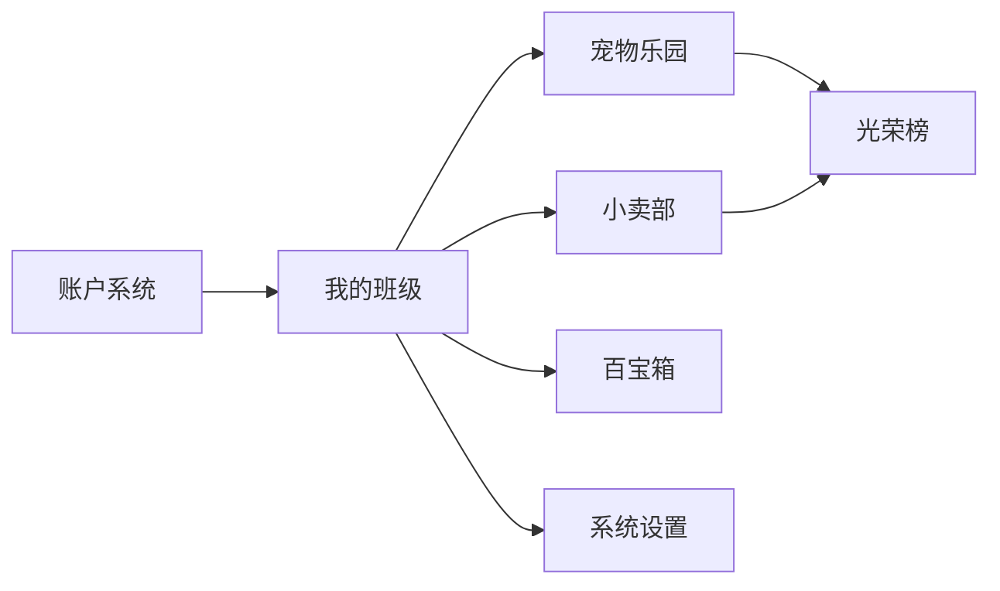

# 班级养宠网站项目演示文档 (Walkthrough)

我已根据您的需求，从零构建了一个高颜值的班级宠物养成与课堂管理系统。本系统集成了趣味化的养成逻辑与实用的教学工具。

## 🚀 核心工作成果概览

### 1. 视觉与交互规范
- **风格**: 全站采用**玻璃拟态 (Glassmorphism)** 设计，配合高斯模糊背景与卡片阴影。
- **配色**: 采用莫兰迪深色调与鲜亮的品牌色（Indigo, Mint, Rose）组合，视觉体验极为高端。
- **动效**: 
  - 使用 `canvas-confetti` 实现领养成功的彩带特效。
  - 使用 `Framer Motion` 规范容器与模态框的淡入与滑出效果。
  - 宠物蛋具备呼吸感浮动动效。

### 2. 功能模块全景
````carousel

<!-- slide -->
#### 🥚 宠物乐园 (Pet Paradise)
- 支持批量导入学生名单（每行一个姓名）。
- **唤醒流程**: 点击神秘蛋 -> 弹出 3D 萌宠库 -> 选择并命名 -> 破壳动效。
- **动态互动**: 现在支持应用教师在设置中自定义的所有奖惩规则。实时同步 EXP 与金币奖励。
- **自动进阶**: 经验值达到阈值时宠物等级自动从 LV1 进化。
<!-- slide -->
#### 🛍️ 小卖部 (Mini Shop)
- **补货管理**: 教师可自定义商品、图标、价格及库存。
- **智能兑换**: 弹出兑换面板，自动置灰金币不足的学生，支持批量选择发货。
<!-- slide -->
#### 🏆 荣誉榜 & 🛠️ 百宝箱
- **实时竞速**: 战力榜与财力榜前10名实时排布，冠军尊享皇冠大卡片。
- **全功能工具**: 
  - **随机点名**: 带滚动律动动画。
  - **计时器**: 全功能倒计时，支持预设。
<!-- slide -->
#### ⚙️ 系统深度管控 (Settings)
- **全量审计日志**: 自动记录每一次加减分、换宠、兑换、修改规则的操作，精确到秒。
- **规则编辑器**: 支持随时新增、修改或删除课堂行为规范。
- **学生列表管理**: 一键重命名班级或移除指定学生。
````

## 🛠️ 技术方案验证

### 前端架构
- **框架**: [App.jsx](file:///Users/xiexiansheng/Desktop/网页/班级养宠/src/App.jsx) 采用集中式状态管理，确保学生数据在乐园、商店、光荣榜间实时同步。
- **组件化**: 封装了通用的玻璃拟态 [Modal.jsx](file:///Users/xiexiansheng/Desktop/网页/班级养宠/src/components/Common/Modal.jsx)。

### 后端与数据库
- **后端**: 已搭建 Cloudflare Workers 环境 [index.js](file:///Users/xiexiansheng/Desktop/网页/班级养宠/src-server/index.js)。
- **Schema**: 定义了完整的 D1 数据库映射表 [schema.sql](file:///Users/xiexiansheng/Desktop/网页/班级养宠/schema.sql)。
- **配置**: 本地资源命名规范及 Cloudflare 绑定已在 [wrangler.toml](file:///Users/xiexiansheng/Desktop/网页/班级养宠/wrangler.toml) 就绪。

## 🏁 下一步建议
您可以直接运行项目（`npm run dev`）体验全套交互流程。后续若需真实数据上云，只需在 Cloudflare 控制台创建对应的 D1 与 KV 实例并将 ID 填入 [wrangler.toml](file:///Users/xiexiansheng/Desktop/网页/班级养宠/class-pets/wrangler.toml) 即可。
